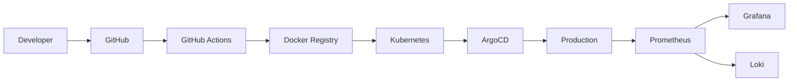

<div align="center">


</div>

---

## 🧬 NEURAL PROFILE

```yaml

identity:

  codename: GRYFFIN

  role: Platform Engineer

  location: Vietnam

  status: ONLINE

specialization:

  - Kubernetes & Cloud Native

  - GitOps · ArgoCD

  - AI Infrastructure

  - Platform Engineering

  - Observability First

philosophy:

  - "Automate Everything"

  - "Infrastructure as Code"

  - "GitOps or Nothing"

```

---

## ⚡ CYBERNETIC STACK

<div align="center">


</div>

---

## 🛰️ ACTIVE SYSTEMS

| SYSTEM | STATUS |

|---|---|

| Kubernetes Clusters | 🟢 ONLINE |

| GitOps Pipeline | 🟢 ACTIVE |

| Monitoring Stack | 🟢 TRACKING |

| AI Research Lab | 🟢 RUNNING |

| Automation Engine | 🟢 DEPLOYED |

---

## ☁️ CYBER INFRASTRUCTURE



---

## 📊 DEPLOYMENT ANALYTICS

<div align="center">


</div>

---

## 🧠 CORE DIRECTIVES

```diff

+ BUILD RESILIENT SYSTEMS

+ SCALE WITHOUT FEAR

+ AUTOMATE REPETITIVE TASKS

+ OBSERVE EVERYTHING

+ PUSH TO PRODUCTION

```

---

<div align="center">


### ⚡ "THE CLOUD IS JUST SOMEONE ELSE'S COMPUTER."


</div>
