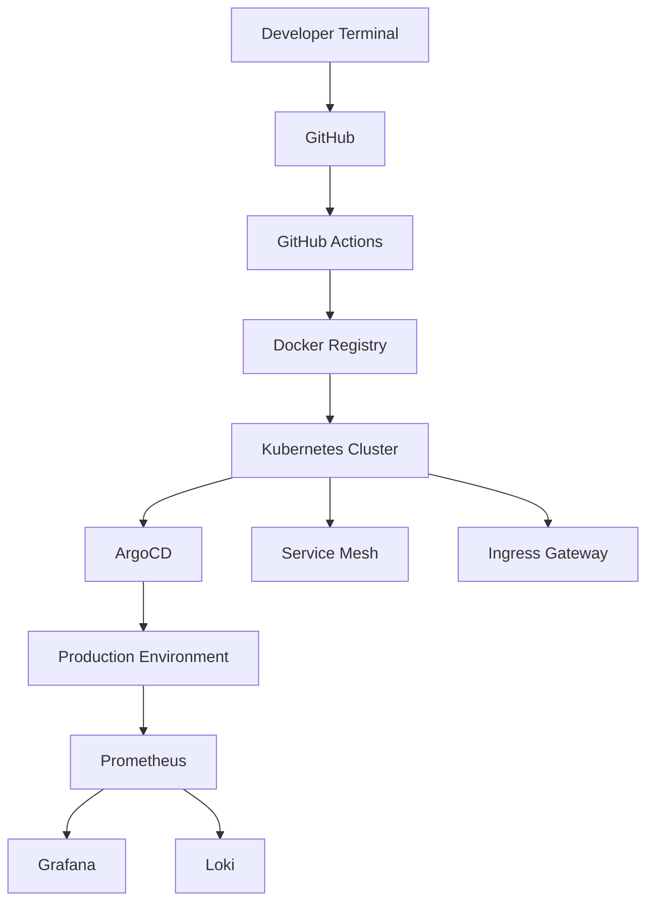

<div align="center">


<br>


</div>

---

# 🌌 NEURAL PROFILE

```yaml
identity:
  codename: GRYFFIN
  role: Cyberpunk Platform Engineer
  location: Vietnam
  status: ONLINE

specialization:
  - Kubernetes
  - Cloud Native Infrastructure
  - GitOps
  - AI Systems
  - Platform Engineering
  - Automation

active_missions:
  - Building distributed systems
  - Researching AI infrastructure
  - Scaling Kubernetes clusters
  - Designing observable platforms

philosophy:
  - "Automate Everything"
  - "Infrastructure as Code"
  - "Observability First"
  - "GitOps or Nothing"
```

---

# ⚡ CYBERNETIC STACK

<div align="center">


</div>

---

# 🛰️ ACTIVE SYSTEMS

<div align="center">

| SYSTEM | STATUS |
|---|---|
| Kubernetes Clusters | 🟢 ONLINE |
| GitOps Pipeline | 🟢 ACTIVE |
| Monitoring Stack | 🟢 TRACKING |
| AI Research Lab | 🟢 RUNNING |
| Automation Engine | 🟢 DEPLOYED |
| Infrastructure Mesh | 🟢 STABLE |

</div>

---

# ☁️ CYBER INFRASTRUCTURE

<div align="center">



</div>

---

# 🔥 DEPLOYMENT ANALYTICS

<div align="center">


</div>

---

# 📈 NEURAL ACTIVITY MAP

<div align="center">

[](https://github.com/YOUR_USERNAME)

</div>

---

# 🐍 CYBER SNAKE

<div align="center">


</div>

---

# 🎧 SYNTHWAVE MODE

<div align="center">


</div>

---

# 🧠 CORE DIRECTIVES

<div align="center">

```text
> BUILD RESILIENT SYSTEMS
> SCALE WITHOUT FEAR
> AUTOMATE REPETITIVE TASKS
> OBSERVE EVERYTHING
> EMBRACE CLOUD NATIVE
> PUSH TO PRODUCTION
```

</div>

---

# 🌃 NIGHT CITY TERMINAL

<div align="center">


</div>

---

# 🚀 VISITOR COUNTER

<div align="center">


</div>

---

# ⚠️ SYSTEM MESSAGE

<div align="center">

```diff
+ SYSTEM STATUS: STABLE
+ ORCHESTRATION: ACTIVE
+ OBSERVABILITY: ENABLED
+ AUTOMATION: ONLINE
```

</div>

---

<div align="center">

# ⚡ "THE CLOUD IS JUST SOMEONE ELSE'S COMPUTER."


</div>
